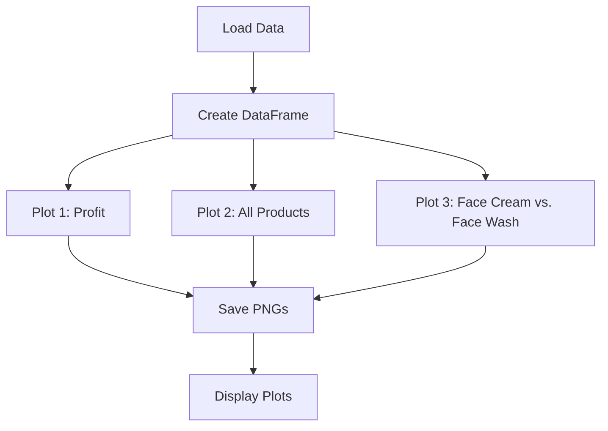

# Sales Data Visualization Project 📊✨  
Uncover powerful insights from company sales data with stunning Python visualizations!  
This Python project transforms raw sales data into three captivating visualizations using Pandas and Matplotlib, answering critical business questions about profit trends, product performance, and face cream vs. face wash sales. Designed for a class assignment, it showcases data analysis, clean code, and professional presentation.  
## 📋 Table of Contents  
- 🌟 Why It’s Awesome  
- 📊 Dataset  
- 🖼️ Visualizations  
- 🛠️ Installation  
- 🚀 Usage  
- 📂 Project Structure  
- 🖌️ Adding Images  
- ✅ Project Status  
- 🤝 Contributing  
- 📜 License  
- 🙏 Acknowledgments  
## 🌟 Why It’s Awesome  
This project isn’t just code—it’s a story told through data! Here’s why it stands out:  
- Insightful Visuals: Three plots reveal profit peaks, top products, and sales comparisons.  
- Professional Design: Formatted axes, month names, and value labels make plots publication-ready.  
- Portable Data: Embedded dataset ensures instant setup—no file hassles.  
- Scalable Code: Easily extend to new datasets or visualizations.  
- GitHub-Ready: Push to your repo and impress with a polished README!  
> [!NOTE] Perfect for class projects, portfolios, or learning data visualization with Python.  
## 📊 Dataset  
The dataset (embedded in `main.py`) covers 12 months with 9 columns:  
- `month_number`: 1–12 (Jan–Dec)  
- `facecream`, `facewash`, `toothpaste`, `bathingsoap`, `shampoo`, `moisturizer`: Sales units  
- `total_units`: Total units sold  
- `total_profit`: Total profit (USD)  
### 📋 Sample Data  
| month_number | facecream | facewash | toothpaste | bathingsoap | shampoo | moisturizer | total_units | total_profit |  
|--------------|-----------|----------|------------|-------------|---------|-------------|--------------|--------------|  
| 1 | 2500 | 1500 | 5200 | 9200 | 1200 | 1500 | 21100 | 211000 |  
| 2 | 2630 | 1200 | 5100 | 6100 | 2100 | 1200 | 18330 | 183300 |  
| 3 | 2140 | 1340 | 4550 | 9550 | 3550 | 1340 | 22470 | 224700 |  
## 🖼️ Visualizations  
Explore the data through three stunning plots, saved as PNGs in `images/`:  
| Figure | Description |  
|--------|-------------|  
| Figure 1 | Line plot of monthly profit (red dotted line, black markers). |  
| Figure 2 | Multi-line plot comparing six products’ sales. |  
| Figure 3 | Bar plot of face cream vs. face wash sales. |  
> [!TIP] Click images to enlarge or view PNGs in `images/` for high resolution.  
## 🛠️ Installation  
Get started in minutes on Windows, macOS, or Linux.  
### Windows  
```bash  
pip install pandas matplotlib numpy  
```  
### macOS/Linux  
```bash  
pip3 install pandas matplotlib numpy  
```  
> [!WARNING] Ensure Python 3.13 is installed. Run `python --version` to check.  
## 🚀 Usage  
Clone the repository:  
```bash  
git clone https://github.com/<your-username>/sales-data-visualization.git  
cd sales-data-visualization  
```  
Run the script:  
```bash  
python main.py  
```  
Outputs:  
- Three plots display.  
- PNGs save to `images/`:  
  - `profit_plot.png`  
  - `all_products_plot.png`  
  - `facecream_facewash_plot.png`  
Example Code Snippet:  
```python  
plt.plot(data['month_number'], data['total_profit'], linestyle=':', marker='o', color='red')  
plt.xlabel('Month')  
plt.ylabel('Profit ($)')  
plt.title('Monthly Profit')  
```  
## 📂 Project Structure  
```
sales-data-visualization/  
├── main.py                   # Core script with data and visualizations  
├── README.md                 # Project documentation  
├── images/                   # Visualization outputs  
│   ├── profit_plot.png       # Figure 1  
│   ├── all_products_plot.png # Figure 2  
│   ├── facecream_facewash_plot.png # Figure 3  
```  
## 🖌️ Adding Images  
Images are generated by `main.py` and saved in `images/`. To ensure they display:  
1. Run `main.py` to create:  
   - `profit_plot.png`  
   - `all_products_plot.png`  
   - `facecream_facewash_plot.png`  
2. Place PNGs in `images/` (create the folder if needed).  
For GitHub:  
- Commit and push `images/` to your repository.  
- Use relative paths: `images/profit_plot.png`.  
- If images don’t show, check paths or use absolute URLs:  
  `https://raw.githubusercontent.com/<your-username>/sales-data-visualization/main/images/profit_plot.png`  
## ✅ Project Status  
- [x] Data embedded in `main.py`  
- [x] Line plot for profit  
- [x] Multi-line plot for products  
- [x] Bar plot for face cream vs. face wash  
- [x] Images saved as PNGs  
- [ ] Add interactive plots (future enhancement)  
**Progress**: ██████████ 90%  
## 🤝 Contributing  
Love the project? Contribute! 😊  
1. Fork the repo.  
2. Create a branch: `git checkout -b feature-name`  
3. Commit changes: `git commit -m "Add feature"`  
4. Push: `git push origin feature-name`  
5. Open a pull request.  
## 📜 License  
Licensed under the **MIT License**. Use freely for educational purposes.  
## 🙏 Acknowledgments  
- **Pandas & Matplotlib**: For powerful data handling and visualization.  
- **Teacher**: For inspiring this project.  
- **GitHub**: For hosting and Markdown awesomeness.  
### 📈 Workflow Diagram (Mermaid)  

